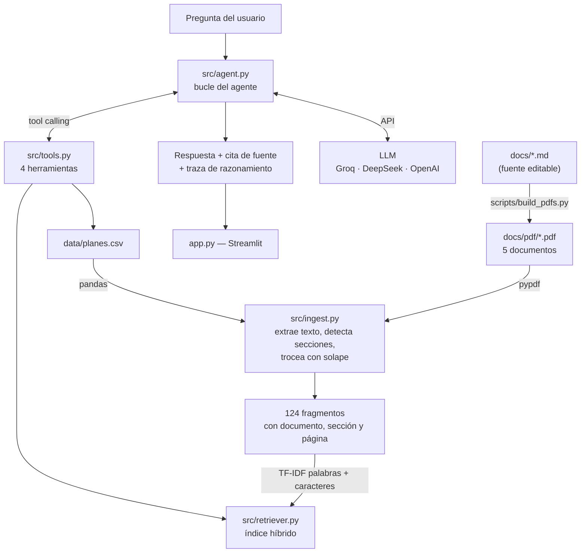

# 📅 Agente de Soporte — Brokitech Turnos

Agente de inteligencia artificial que responde consultas de soporte de un SaaS
real, apoyándose exclusivamente en su documentación oficial en PDF y CSV.

**Challenge Alura — Agente Inteligente** · Categoría: SaaS / Plataforma Digital

[](https://challenge-alura-agente-7er556nwbljvpv6z8skhet.streamlit.app)

---

## El problema

Brokitech Turnos es una plataforma de gestión de turnos con cobro de seña por
WhatsApp para negocios de servicios en Argentina. Su documentación son cinco
documentos densos —base de conocimiento, FAQ, política de privacidad, planes y
precios, y términos de uso— que suman unas 40 páginas.

El soporte de primera línea se va casi entero en responder lo mismo: *"¿me cobran
comisión sobre la seña?"*, *"¿puedo usar mi número de WhatsApp Business?"*,
*"¿qué plan me conviene si somos ocho?"*. Todas esas respuestas ya están
escritas; el problema es que nadie se lee 40 páginas para encontrarlas.

Este agente las contesta en segundos, **citando el documento y la página** de
donde sacó cada dato, y admitiendo cuando algo no está cubierto en lugar de
inventarlo.

---

## Qué lo hace un agente y no sólo un buscador

No es un RAG que concatena texto y se lo pasa al modelo. El agente **decide qué
herramienta usar** en cada consulta, y puede encadenar varias antes de responder:

| Herramienta | Qué hace | Cuándo la elige |
|---|---|---|
| `buscar_en_documentacion` | Búsqueda sobre los 5 PDF | Cualquier consulta de contenido |
| `consultar_planes` | Lee la fila exacta del CSV | Precios, cupos, comparar planes |
| `calcular_presupuesto` | Cálculo determinístico en Python | "Somos 8 y hacemos 1200 turnos" |
| `escalar_a_humano` | Genera un ticket de soporte | La doc no alcanza, o hay un reclamo |

La diferencia se nota en el caso de presupuesto. Preguntarle a un modelo que
multiplique excedentes es pedirle que se equivoque; acá la aritmética la hace
Python sobre el CSV y el modelo sólo redacta el resultado.

También importa que **la documentación nunca entra entera en el prompt**. El
modelo pide sólo los fragmentos que necesita, así que el consumo de tokens no
crece aunque el corpus se multiplique.

---

## Arquitectura



### El flujo, en concreto

1. Los cinco documentos se escriben en Markdown y se compilan a PDF. **El PDF es
   la fuente que consume el agente**, no un adorno: se lee con `pypdf` igual que
   se leería un PDF que mandó un cliente.
2. `ingest.py` extrae el texto página por página, reconstruye a qué sección
   pertenece cada línea y lo parte en fragmentos de ~1000 caracteres con solape,
   guardando en cada uno su documento, sección y número de página.
3. `retriever.py` indexa los fragmentos con dos vistas TF-IDF y las fusiona.
4. `agent.py` recibe la pregunta y le da al modelo el catálogo de herramientas.
   El modelo elige, se ejecutan localmente, los resultados vuelven, y el ciclo
   se repite hasta que redacta la respuesta final.

### Dos decisiones de diseño

**Por qué TF-IDF y no embeddings.** El corpus son cinco documentos de vocabulario
cerrado y muy técnico ("seña", "no-show", "pre-reserva", "ventana de 24 horas").
La coincidencia léxica funciona muy bien ahí. A cambio: arranca instantáneo, no
descarga modelos de cientos de MB, corre en cualquier VM gratuita sin GPU y no
agrega una dependencia externa más. Se usan dos vistas combinadas —palabras y
bigramas al 65%, n-gramas de caracteres al 35%— para que tolere errores de tipeo
y falta de acentos sin perder precisión.

**Cómo se evita el ruido fuera de dominio.** Los n-gramas de caracteres le dan
~0.04 de similitud a *cualquier* texto en español, incluso a "receta de
milanesas". Medido sobre el corpus, lo que separa limpio una consulta ajena es
que su similitud **por palabras** da exactamente cero, mientras que una consulta
mal tipeada conserva ≥0.14. Por eso el buscador exige un piso léxico además del
umbral de puntaje: prefiere devolver nada —y que el agente diga que no sabe— a
devolver ruido que el modelo podría tomar como cierto. Está fijado en los tests.

---

## Tecnologías

| Componente | Herramienta | Por qué |
|---|---|---|
| Modelo de lenguaje | **Groq** (`openai/gpt-oss-120b`) | Tier gratuito, tool calling sólido. Intercambiable: el cliente usa el SDK de OpenAI con `base_url` configurable, así que sirve DeepSeek, OpenAI o cualquier API compatible cambiando variables de entorno |
| Lectura de PDF | **pypdf** | Extracción de texto por página, sin dependencias del sistema |
| Generación de PDF | **reportlab** | Compila el Markdown a PDF con fuente embebida |
| Búsqueda | **scikit-learn** (TF-IDF) | Índice híbrido liviano, sin GPU |
| Datos tabulares | **pandas** | Lectura y consulta del CSV de planes |
| Interfaz | **Streamlit** | Chat web en pocas líneas, deploy directo |
| Tests | **pytest** + `streamlit.testing` | 43 tests sobre extracción, búsqueda, herramientas e interfaz |

> **Nota sobre las fuentes del PDF.** La primera versión usaba las fuentes base
> de PDF (Helvetica), que se escriben sin tabla `ToUnicode`: al extraer el texto,
> todas las vocales acentuadas volvían como `U+FFFD` y el índice quedaba
> corrupto en español. Se resolvió embebiendo una TrueType (Vera, que viene con
> reportlab, así que funciona igual en Windows y en Linux). Hay un test de
> regresión que falla si vuelve a pasar.

---

## Estructura

```
.
├── app.py                      # Interfaz web (Streamlit)
├── cli.py                      # Mismo agente por terminal
├── requirements.txt
├── .env.example
├── src/
│   ├── config.py               # Configuración desde variables de entorno
│   ├── ingest.py               # Lectura de PDF/CSV, troceado con procedencia
│   ├── retriever.py            # Índice TF-IDF híbrido
│   ├── tools.py                # Las 4 herramientas + sus esquemas JSON
│   └── agent.py                # Bucle de tool calling y prompt del sistema
├── docs/
│   ├── 01-base-conocimiento.md # ─┐
│   ├── 02-faq-soporte.md       #  │
│   ├── 03-politica-privacidad.md# │ fuente editable
│   ├── 04-planes-precios.md    #  │
│   ├── 05-terminos-uso.md      # ─┘
│   ├── pdf/                    # PDF generados: lo que el agente lee
│   └── EJEMPLOS.md             # Preguntas y respuestas reales del agente
├── data/
│   └── planes.csv              # Tabla de planes (fuente CSV del challenge)
├── scripts/
│   ├── build_pdfs.py           # Markdown -> PDF
│   └── generar_ejemplos.py     # Corre la batería de preguntas y guarda la salida
├── tests/
│   ├── test_pipeline.py        # extraccion, busqueda y herramientas
│   └── test_app.py             # interfaz, con el runner de Streamlit
└── deploy/
    ├── README-DEPLOY.md        # Streamlit Cloud / Hugging Face / Docker
    ├── README-OCI.md           # Deploy en Oracle Cloud, paso a paso
    ├── Dockerfile
    ├── docker-compose.yml
    ├── agente-brokitech.service
    └── nginx-agente.conf
```

---

## Cómo ejecutarlo

### 1. Clonar e instalar

```bash
git clone https://github.com/brokitech-rgb/Challenge-Alura-Agente.git
cd Challenge-Alura-Agente
python -m venv .venv
```

En Linux o macOS:

```bash
source .venv/bin/activate && pip install -r requirements.txt
```

En Windows (PowerShell):

```bash
.venv\Scripts\Activate.ps1; pip install -r requirements.txt
```

### 2. Configurar la clave del modelo

```bash
cp .env.example .env
```

Editá `.env` y poné tu clave. La más simple es [Groq](https://console.groq.com),
que tiene tier gratuito y no pide tarjeta:

```
GROQ_API_KEY=gsk_tu-clave
LLM_MODEL=openai/gpt-oss-120b
```

El proveedor se detecta solo según qué clave esté cargada. También funciona con
`DEEPSEEK_API_KEY` u `OPENAI_API_KEY` sin tocar el código.

> **Sin clave también funciona.** La app arranca en *modo demo* y devuelve los
> extractos textuales que recupera de los PDF, sin redacción del modelo. Sirve
> para ver el pipeline de lectura y búsqueda funcionando.

### 3. Levantar la app

```bash
streamlit run app.py
```

Queda en `http://localhost:8501`. Los PDF se generan solos en el primer arranque.

### Otras formas de correrlo

```bash
python cli.py "¿hay descuento por pago anual?"
```

```bash
python -m pytest -q
```

```bash
python scripts/generar_ejemplos.py
```

---

## Ejemplos de preguntas que responde

**Datos puntuales**
- ¿Brokitech se queda con una parte de la seña que cobro?
- Si cancelo la suscripción, ¿cuánto tiempo tengo para exportar mis datos?
- ¿Cuántos días de anticipación se puede reservar un turno?
- ¿Emiten factura A?

**Comparar y recomendar**
- ¿Qué diferencia hay entre el plan Profesional y el Negocio?
- Somos 8 profesionales y hacemos 1200 turnos por mes, ¿qué plan me conviene?
- ¿Cuánto ahorro pagando por año?

**Políticas y letra chica**
- ¿Usan las conversaciones de mis clientes para entrenar modelos de IA?
- ¿Qué pasa si no pago? ¿Cuándo pierdo los datos?
- ¿Qué compensación me corresponde si incumplen el SLA?

**Soporte técnico**
- El bot dejó de responderle a mis clientes, ¿qué reviso?
- Un cliente pagó pero el turno no se confirmó.
- Importé un CSV y me quedaron clientes duplicados.

**Casos donde lo correcto es *no* responder**
- ¿Se integra con AFIP? → *está en roadmap, no disponible; el agente lo aclara*
- ¿Cuál es la mejor receta de milanesas? → *fuera de la documentación*
- Me cobraron dos veces → *deriva a soporte humano con un ticket*

---

## Ejemplos de respuestas generadas

El archivo **[docs/EJEMPLOS.md](docs/EJEMPLOS.md)** contiene la salida textual
del agente sobre las diez preguntas de la batería, sin editar. Se regenera con:

```bash
python scripts/generar_ejemplos.py
```

### Muestra: recuperación y cita de fuente

Salida real capturada con la app corriendo, en modo demo (sin llamar al modelo),
para la pregunta *"¿Brokitech se queda con una parte de la seña?"*:

> **1. FAQ de Soporte, pág. 2, sección «C1. ¿Brokitech se queda con parte de la seña?»**
>
> C1. ¿Brokitech se queda con parte de la seña? No. El 100% de la seña va a tu
> cuenta de Mercado Pago. Nosotros cobramos únicamente el abono mensual del
> plan. La única deducción es la comisión de Mercado Pago, que es de ellos, no
> nuestra.
>
> **2. Base de Conocimiento del Producto, pág. 1, sección «1.1 Propuesta de valor en una línea»**
>
> Reservás por WhatsApp, pagás la seña por Mercado Pago, y el turno queda
> confirmado automáticamente en la agenda del negocio.

El agente localizó la respuesta exacta en el documento correcto, con página y
sección, entre 124 fragmentos. Con la clave cargada, el modelo redacta esto en
una respuesta en prosa y agrega la línea `Fuente: FAQ de Soporte, pág. 2`.

### Muestra: cálculo determinístico

Salida real de `calcular_presupuesto("Profesional", profesionales=8, turnos_por_mes=1200)`:

```json
{
  "plan": "Profesional",
  "abono_base_mensual": "$39.900",
  "profesionales_incluidos": 5,
  "profesionales_adicionales": 3,
  "cargo_profesionales_adicionales": "$14.700",
  "turnos_declarados_por_mes": 1200,
  "cupo_turnos_del_plan": "800",
  "turnos_excedentes": 400,
  "cargo_turnos_excedentes": "$38.000",
  "total_mensual": "$92.600"
}
```

Con estos números el agente puede razonar algo que un buscador no: el plan
Profesional le sale **$92.600** por mes, mientras que el Negocio —que incluye 15
profesionales y turnos ilimitados— cuesta **$79.900**. Le conviene el plan más
caro. Esa conclusión sale de aritmética hecha en Python, no de una estimación
del modelo.

---

## Deploy

La app está desplegada y accesible públicamente. Las instrucciones completas de
las tres plataformas están en **[deploy/README-DEPLOY.md](deploy/README-DEPLOY.md)**:

| Plataforma | Estado | Guía |
|---|---|---|
| **Streamlit Community Cloud** | ✅ **En uso** — gratis, sin tarjeta | [README-DEPLOY.md](deploy/README-DEPLOY.md) |
| Hugging Face Spaces | Alternativa gratuita | [README-DEPLOY.md](deploy/README-DEPLOY.md) |
| Oracle Cloud (OCI) | Dockerfile + systemd + nginx listos | [README-OCI.md](deploy/README-OCI.md) |

### 🔗 Aplicación en vivo

**https://challenge-alura-agente-7er556nwbljvpv6z8skhet.streamlit.app**

Desplegada en Streamlit Community Cloud desde la rama `master` de este
repositorio. La clave del modelo se inyecta como secreto de la plataforma, así
que no viaja en el código.

> Las apps del tier gratuito se suspenden tras varios días sin visitas y se
> reactivan solas con la primera carga, que puede tardar hasta un minuto.

### Verificación del deploy

Comprobaciones hechas contra la instancia publicada:

```console
$ curl -s -o /dev/null -w '%{http_code}' https://challenge-alura-agente-7er556nwbljvpv6z8skhet.streamlit.app/~/+/
200

$ curl -s https://challenge-alura-agente-7er556nwbljvpv6z8skhet.streamlit.app/~/+/_stcore/health
ok
```

Y en la barra lateral de la app publicada:

| Indicador | Valor observado |
|---|---|
| Estado del modelo | `groq · openai/gpt-oss-120b` (no "modo demo") |
| Documentos indexados | 6 (5 PDF + 1 CSV) |
| Fragmentos | 124 |

Que el badge muestre el modelo y no "modo demo" confirma que el secreto
`GROQ_API_KEY` se inyectó correctamente desde la plataforma: la app lo lee de
`st.secrets` además de las variables de entorno, porque Streamlit Cloud no
siempre lo expone como variable de entorno.

---

## Tests

```bash
python -m pytest -q
```

```
43 passed
```

Cubren las cuatro capas donde el proyecto se puede romper en silencio:

- **Extracción** — que los 5 PDF se lean, que no se cuelen encabezados ni pies,
  que cada fragmento conserve su procedencia y que **los acentos sobrevivan**
  (el test de regresión del bug de `ToUnicode`).
- **Búsqueda** — que encuentre lo relevante, que tolere falta de acentos y
  errores de tipeo, y que **no devuelva nada** ante consultas fuera de dominio.
- **Herramientas** — precios exactos contra el CSV, la aritmética de excedentes,
  y los casos borde: plan inexistente, Enterprise (que se cotiza a medida) y el
  plan Inicial, que no admite profesionales adicionales.
- **Interfaz** — `tests/test_app.py` ejecuta `app.py` con el runner de Streamlit
  y verifica el cableado en modo demo: que el click en una sugerencia dispare la
  consulta, que las sugerencias desaparezcan después, y que **cada pregunta
  produzca exactamente un par de mensajes**. Ese último cubre una regresión
  real: la primera versión renderizaba el turno y además hacía `st.rerun()`, con
  lo que cada mensaje quedaba duplicado en el árbol de la página.

---

## Licencia

MIT.

---

*Proyecto desarrollado para el Challenge Alura — Agente Inteligente.*
